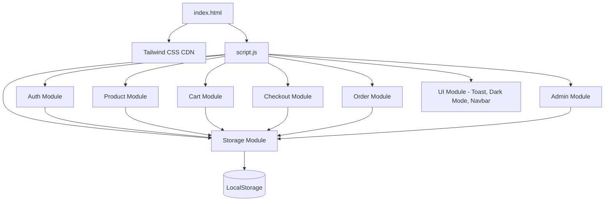

# Dokumen Desain: ecommerce-spa

## Ikhtisar

Aplikasi ini adalah E-Commerce SPA (Single Page Application) berbasis frontend murni yang terdiri dari dua file: `index.html` dan `script.js`. Tidak ada build tool, framework, atau backend. Tailwind CSS dimuat via CDN. Semua state disimpan di LocalStorage. Navigasi antar "halaman" dilakukan dengan menampilkan/menyembunyikan section HTML menggunakan JavaScript.

---

## Arsitektur



### Prinsip Arsitektur

- **Modular Functional**: Setiap modul adalah kumpulan fungsi murni yang beroperasi pada state di LocalStorage.
- **Single Source of Truth**: LocalStorage adalah satu-satunya sumber data. Semua modul membaca dan menulis ke sana.
- **SPA Navigation**: Satu fungsi `navigate(page)` mengontrol visibilitas section HTML.
- **Event-Driven**: Semua interaksi pengguna ditangani melalui event listener yang terpusat.

---

## Komponen dan Antarmuka

### Struktur HTML (index.html)

```
<body>
  <div id="toast-container">          <!-- Toast notifications -->
  <nav id="navbar">                   <!-- Navbar global -->
  <main>
    <section id="page-home">          <!-- Product grid + filter -->
    <section id="page-login">         <!-- Form login -->
    <section id="page-register">      <!-- Form register -->
    <section id="page-cart">          <!-- Keranjang belanja -->
    <section id="page-checkout">      <!-- Form checkout -->
    <section id="page-orders">        <!-- Riwayat pesanan -->
    <section id="page-admin">         <!-- Panel admin -->
    <div id="modal-product">          <!-- Modal detail produk -->
  </main>
</body>
```

### Modul JavaScript (script.js)

#### 1. Storage Module
Abstraksi atas LocalStorage.

```js
// Kunci LocalStorage
const KEYS = {
  USERS: 'users',
  SESSION: 'session',
  CART: 'cart',
  ORDERS: 'order_history',
  PRODUCTS: 'products',
  DARK_MODE: 'dark_mode'
}

function storageGet(key)        // Membaca dan mem-parse JSON dari LocalStorage
function storageSet(key, value) // Menyimpan nilai sebagai JSON ke LocalStorage
```

#### 2. Auth Module
```js
function authRegister(name, email, password) // Validasi & simpan user baru
function authLogin(email, password)          // Validasi & buat sesi
function authLogout()                        // Hapus sesi
function authGetSession()                    // Kembalikan objek sesi aktif atau null
function authIsAdmin()                       // Cek apakah sesi aktif adalah admin
```

#### 3. Product Module
```js
function productGetAll()                     // Ambil semua produk (Storage atau default)
function productFilter(query, category, minPrice, maxPrice) // Filter produk
function productRenderGrid(products)         // Render HTML grid produk
function productShowModal(productId)         // Tampilkan modal detail produk
function productAdd(product)                 // Tambah produk baru (admin)
function productDelete(productId)            // Hapus produk (admin)
```

#### 4. Cart Module
```js
function cartGet()                           // Ambil data cart dari Storage
function cartAdd(productId)                  // Tambah/increment item di cart
function cartUpdateQty(productId, qty)       // Update quantity item
function cartRemove(productId)               // Hapus item dari cart
function cartClear()                         // Kosongkan cart
function cartGetTotal()                      // Hitung total harga
function cartRender()                        // Render HTML halaman cart
function cartGetItemCount()                  // Hitung total jumlah item (untuk badge)
```

#### 5. Checkout Module
```js
function checkoutProcess(name, address, phone) // Validasi, generate ID, simpan order, clear cart
function generateTransactionId()               // Generate ID unik (timestamp + random)
```

#### 6. Order Module
```js
function orderGetAll()                       // Ambil semua riwayat pesanan
function orderRender()                       // Render HTML halaman riwayat pesanan
```

#### 7. Admin Module
```js
function adminRender()                       // Render halaman admin panel
function adminAddProduct(formData)           // Tambah produk dari form admin
function adminDeleteProduct(productId)       // Hapus produk dari admin
```

#### 8. UI Module
```js
function navigate(page)                      // Tampilkan section yang sesuai, sembunyikan lainnya
function showToast(message, type)            // Tampilkan toast notification
function updateNavbar()                      // Perbarui state navbar (badge, user info)
function toggleDarkMode()                    // Toggle dark mode
function initDarkMode()                      // Inisialisasi dark mode dari Storage
```

---

## Model Data

### User Object
```json
{
  "id": "user_1234567890",
  "name": "Budi Santoso",
  "email": "budi@email.com",
  "password": "hashed_or_plain",
  "role": "user"
}
```

### Session Object (key: `session`)
```json
{
  "userId": "user_1234567890",
  "name": "Budi Santoso",
  "email": "budi@email.com",
  "role": "user"
}
```

### Product Object
```json
{
  "id": "prod_001",
  "name": "Kemeja Batik Pria",
  "price": 150000,
  "category": "Pakaian",
  "description": "Kemeja batik modern dengan motif klasik.",
  "image": "https://placehold.co/400x300?text=Kemeja+Batik"
}
```

### Cart Object (key: `cart`) — Array of CartItem
```json
[
  {
    "productId": "prod_001",
    "name": "Kemeja Batik Pria",
    "price": 150000,
    "quantity": 2,
    "image": "https://placehold.co/400x300?text=Kemeja+Batik"
  }
]
```

### Order Object (key: `order_history`) — Array of Order
```json
[
  {
    "transactionId": "TXN-1718000000000-4521",
    "date": "2024-06-10T10:00:00.000Z",
    "customer": {
      "name": "Budi Santoso",
      "address": "Jl. Merdeka No. 1, Jakarta",
      "phone": "081234567890"
    },
    "items": [...],
    "total": 300000
  }
]
```

### Data Produk Default (8 produk, 4 kategori)

| ID | Nama | Harga | Kategori |
|----|------|-------|----------|
| prod_001 | Kemeja Batik Pria | 150.000 | Pakaian |
| prod_002 | Dress Casual Wanita | 200.000 | Pakaian |
| prod_003 | Laptop Stand Aluminium | 350.000 | Elektronik |
| prod_004 | Wireless Mouse | 120.000 | Elektronik |
| prod_005 | Sepatu Sneakers Pria | 450.000 | Sepatu |
| prod_006 | Sandal Wanita Casual | 95.000 | Sepatu |
| prod_007 | Tas Ransel Laptop | 280.000 | Tas |
| prod_008 | Dompet Kulit Pria | 175.000 | Tas |

---

## Properti Kebenaran (Correctness Properties)

*Sebuah properti adalah karakteristik atau perilaku yang harus berlaku di semua eksekusi valid dari sebuah sistem — pada dasarnya, pernyataan formal tentang apa yang harus dilakukan sistem. Properti berfungsi sebagai jembatan antara spesifikasi yang dapat dibaca manusia dan jaminan kebenaran yang dapat diverifikasi oleh mesin.*


### Properti 1: Registrasi dengan kredensial valid menyimpan user ke Storage
*Untuk semua* kombinasi nama, email unik, dan password dengan panjang >= 6 karakter, memanggil `authRegister()` harus menghasilkan user tersebut tersimpan di array `users` di Storage.
**Memvalidasi: Persyaratan 1.2**

### Properti 2: Registrasi dengan email duplikat ditolak
*Untuk semua* email yang sudah ada di Storage, mencoba mendaftarkan email yang sama harus mengembalikan error dan tidak menambah entri baru ke array `users`.
**Memvalidasi: Persyaratan 1.3**

### Properti 3: Registrasi dengan password pendek ditolak
*Untuk semua* string password dengan panjang < 6 karakter, `authRegister()` harus mengembalikan error dan tidak menyimpan user baru.
**Memvalidasi: Persyaratan 1.4**

### Properti 4: Round-trip sesi (login → logout)
*Untuk semua* user yang terdaftar, melakukan login harus menghasilkan sesi aktif di Storage; melakukan logout setelahnya harus menghasilkan sesi null di Storage.
**Memvalidasi: Persyaratan 1.5, 1.7**

### Properti 5: Login dengan kredensial salah ditolak
*Untuk semua* kombinasi email/password yang tidak cocok dengan data di Storage, `authLogin()` harus mengembalikan error dan tidak membuat sesi.
**Memvalidasi: Persyaratan 1.6**

### Properti 6: Filter produk komprehensif
*Untuk semua* daftar produk, kata kunci pencarian, kategori, dan rentang harga, fungsi `productFilter()` harus mengembalikan hanya produk yang namanya mengandung kata kunci (case-insensitive) DAN kategorinya cocok DAN harganya berada dalam rentang yang ditentukan.
**Memvalidasi: Persyaratan 2.3, 2.4, 2.5, 2.6**

### Properti 7: Round-trip cart (tambah → hapus)
*Untuk semua* produk, menambahkan produk ke cart lalu menghapusnya harus menghasilkan cart yang tidak mengandung produk tersebut, dengan jumlah item yang sama seperti sebelum penambahan.
**Memvalidasi: Persyaratan 3.1, 3.4**

### Properti 8: Penambahan produk yang sama menambah quantity, bukan duplikat
*Untuk semua* produk yang sudah ada di cart, menambahkannya lagi harus menghasilkan tepat satu entri dengan quantity bertambah 1, bukan dua entri terpisah.
**Memvalidasi: Persyaratan 3.2**

### Properti 9: Invariant total harga cart
*Untuk semua* state cart, nilai yang dikembalikan `cartGetTotal()` harus selalu sama dengan `sum(item.price * item.quantity)` untuk semua item di cart.
**Memvalidasi: Persyaratan 3.3, 3.5**

### Properti 10: Persistensi cart di Storage
*Untuk semua* state cart, membaca cart dari Storage setelah operasi tulis harus mengembalikan data yang identik dengan yang ditulis.
**Memvalidasi: Persyaratan 3.8**

### Properti 11: Checkout berhasil mengosongkan cart dan menyimpan order
*Untuk semua* cart yang tidak kosong dan data form checkout yang valid, memanggil `checkoutProcess()` harus menghasilkan: cart kosong di Storage, satu entri order baru di `order_history`, dan Transaction_ID yang ada di entri order tersebut.
**Memvalidasi: Persyaratan 4.3**

### Properti 12: Transaction_ID selalu unik
*Untuk semua* pasangan pemanggilan `generateTransactionId()`, kedua nilai yang dihasilkan harus berbeda.
**Memvalidasi: Persyaratan 4.4**

### Properti 13: Round-trip manajemen produk admin (tambah → hapus)
*Untuk semua* data produk valid, menambahkan produk via `adminAddProduct()` lalu menghapusnya via `adminDeleteProduct()` harus menghasilkan daftar produk yang identik dengan daftar sebelum penambahan.
**Memvalidasi: Persyaratan 7.3, 7.5**

### Properti 14: Preferensi Dark Mode persisten di Storage
*Untuk semua* state dark mode, memanggil `toggleDarkMode()` harus menyimpan preferensi baru ke Storage, dan membaca Storage setelahnya harus mengembalikan nilai yang konsisten dengan state saat ini.
**Memvalidasi: Persyaratan 6.4**

---

## Penanganan Error

| Kondisi | Penanganan |
|---------|-----------|
| Email duplikat saat register | Tampilkan pesan error inline di form |
| Password < 6 karakter | Tampilkan pesan error inline di form |
| Login gagal | Tampilkan pesan error inline di form |
| Field checkout kosong | Tampilkan pesan validasi per field |
| Cart kosong saat checkout | Tombol checkout dinonaktifkan / redirect ke halaman produk |
| Pengguna belum login akses checkout/orders | Redirect ke halaman login |
| Produk tidak ditemukan (filter) | Tampilkan empty state "Produk tidak ditemukan" |
| Cart kosong | Tampilkan empty state "Keranjang belanja Anda kosong" |
| Tidak ada riwayat pesanan | Tampilkan empty state "Belum ada pesanan" |
| Field admin kosong | Tampilkan pesan validasi per field |

---

## Strategi Pengujian

### Pendekatan Pengujian Ganda

Pengujian menggunakan dua pendekatan yang saling melengkapi:

1. **Unit Test (Contoh Spesifik)**: Memverifikasi perilaku konkret pada kasus tertentu, edge case, dan kondisi error.
2. **Property-Based Test (PBT)**: Memverifikasi properti universal yang berlaku untuk semua input yang di-generate secara acak.

### Library Property-Based Testing

Gunakan **fast-check** (JavaScript) untuk property-based testing:
```
npm install --save-dev fast-check
```
Atau via CDN untuk pengujian browser langsung.

### Konfigurasi Property Test

- Minimum **100 iterasi** per property test (karena randomisasi).
- Setiap property test harus mereferensikan properti desain dengan format:
  `// Feature: ecommerce-spa, Property N: <teks properti>`

### Cakupan Unit Test

- Autentikasi: register valid, email duplikat, password pendek, login valid, login gagal, logout.
- Produk: filter dengan berbagai kombinasi, empty state filter.
- Cart: tambah item, tambah duplikat, update quantity, hapus item, hitung total, persistensi.
- Checkout: validasi form kosong, generate Transaction_ID, simpan order, kosongkan cart.
- Admin: tambah produk, hapus produk, validasi form.

### Cakupan Property Test

Setiap properti di bagian "Properti Kebenaran" harus diimplementasikan sebagai **satu** property-based test:

| Property | Tag |
|----------|-----|
| Properti 1 | `Feature: ecommerce-spa, Property 1: Registrasi valid menyimpan user` |
| Properti 2 | `Feature: ecommerce-spa, Property 2: Email duplikat ditolak` |
| Properti 3 | `Feature: ecommerce-spa, Property 3: Password pendek ditolak` |
| Properti 4 | `Feature: ecommerce-spa, Property 4: Round-trip sesi` |
| Properti 5 | `Feature: ecommerce-spa, Property 5: Login kredensial salah ditolak` |
| Properti 6 | `Feature: ecommerce-spa, Property 6: Filter produk komprehensif` |
| Properti 7 | `Feature: ecommerce-spa, Property 7: Round-trip cart` |
| Properti 8 | `Feature: ecommerce-spa, Property 8: Duplikat menambah quantity` |
| Properti 9 | `Feature: ecommerce-spa, Property 9: Invariant total harga` |
| Properti 10 | `Feature: ecommerce-spa, Property 10: Persistensi cart` |
| Properti 11 | `Feature: ecommerce-spa, Property 11: Checkout mengosongkan cart` |
| Properti 12 | `Feature: ecommerce-spa, Property 12: Transaction_ID unik` |
| Properti 13 | `Feature: ecommerce-spa, Property 13: Round-trip manajemen produk admin` |
| Properti 14 | `Feature: ecommerce-spa, Property 14: Preferensi Dark Mode persisten` |
